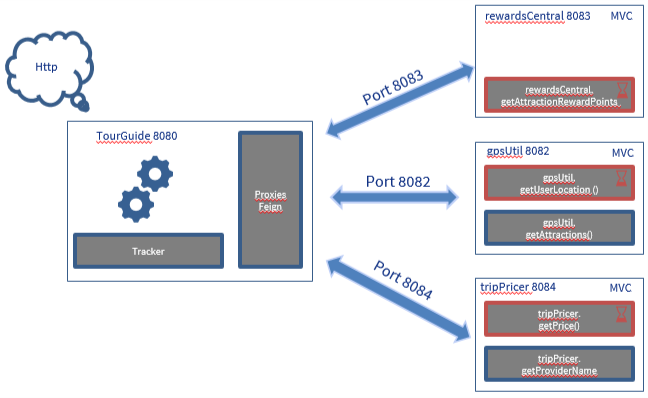

# RewardCentral
API REST micro-service for TourGuide application to managing travel and attraction for a custumer.
RewardCentral manage Reward informations. 
This app use SPRINT BOOT, FeignClient.

## Getting Started

- Endpoint : http://localhost:8081/

## Prerequisites

- Java 1.8 or later
- Spring Boot 2.2.6
- Gradle 2.2.5
- Docker (Optional)

# Installation

##No Database creation needed
###Without Docker
To start the application whitout docker start sub-micro-service with or without docker in build libs directories: 
- RewardCentral : java -jar rewardCentral-0.0.1-SNAPSHOT.jar

###With Docker
Docker construction in project directory 
- docker build --build-arg JAR_FILE=build/libs/*.jar -t springio/gs-spring-boot-docker-rewardcentral .

Docker execution : 
- docker run -p 8083:8083 --name RewardCentral springio/gs-spring-boot-docker-rewardcentral

or
- docker run -p 8083:8083 --name RewardCentral --cpus="1" springio/gs-spring-boot-docker-rewardcentral

# Architecture Diagram

# URI
## get Attraction RewardGPoints
Example : 
http://localhost:8083/getAttractionRewardPoints?attractionId=123e4567-e89b-12d3-a456-426614174000&userId=123e4567-e89b-12d3-a456-426614174000
